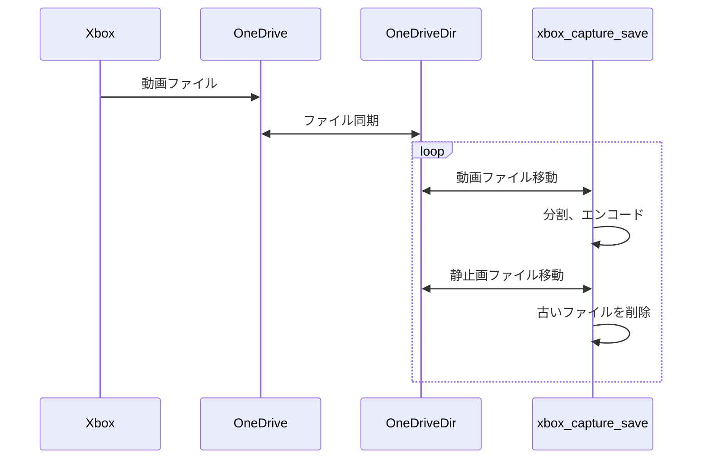

# xbox_capture_save
* Xboxではキャプチャした動画や静止画をOneDriveに保存できる
* しかしOneDriveは5GBしかないのですぐに溜まって消すのが面倒
* WindowsではOneDriveと同期する設定がありWindows側の通常のファイル操作でOneDriveからファイルをコピーしたり消すことができる
* そこで同期したOneDriveからWindows側の通常のディレクトリに移動することでOneDriveのファイルを消す
* さらにBlueskyなどにアップロードしたいのでついでに自動で60秒未満のファイルに分割し圧縮する
* この操作にはおそらくWindowsだけで完結できるが、慣れているためGit Bashを前提とした

## 概要

* One Driveに転送されたXboxの動画ファイルを別のディレクトリに移動する
  * 移動した動画ファイルをBluesky向けに分割する
* One Driveに転送されたXboxの静止画ファイルを別のディレクトリに移動する
* 古いファイルを削除する

## 事前準備
* Windows上のGit Bashで動作するが書き換えればWSLなどでも動くと思う
* ハードウエアエンコードを利かす為にWindows用のffmpegをインストールする
* 必要ならwindowshomedirを書き換える
* workdirを作成する
  
```
#!/usr/bin/bash

windowshomedir="${HOME}/"
onedirvedir="${windowshomedir}OneDrive/動画/Xbox Game DVR/"

encode() {
  src=$1
  onedirvedir=$2
  workdir="${windowshomedir}Videos/xbox/"
  forxdir="${workdir}/tmp/"
  forbsdir="${workdir}/tmp/"
  ffmpegcmd="ffmpeg.exe"
  namewithext="${src#"${onedirvedir}"}"
  name=${namewithext%.mp4}
  # OneDriveの動機が遅いとmvに失敗するためエラー出力抑制と脱出
  mv "$src" "${workdir}" 2> /dev/null
  if [ ! -e "${workdir}${namewithext}" ]; then
    exit 0
  fi

  touch "${workdir}${namewithext}"

  # Bluesky用
  ${ffmpegcmd} \
    -i "${workdir}${namewithext}" \
    -vf "scale=-1:720" -c:v h264_amf -c:a copy -b 7000k \
    -f segment \
    -flags +global_header \
    -segment_format_options movflags=+faststart \
    -reset_timestamps 1 \
    -segment_time 55 \
    "${forbsdir}${name}_bs_%02d.mp4"

  mv "${workdir}${namewithext}" "${forxdir}"
}

while true; do

  find "${onedirvedir}" -name "*.mp4" -print0 | while IFS= read -r -d '' file; do
    encode "${file}" "${onedirvedir}"
  done

  # スクリーンショットを移動
  find "${windowshomedir}OneDrive/Pictures/Xbox Screenshots/" -name "*.*" -print0 | while IFS= read -r -d '' file; do
    mv "$file" "${windowshomedir}Videos/xbox/" 2> /dev/null
  done

  # 古いファイルを削除
  find "${windowshomedir}Videos/xbox/" -mtime +2 -type f -print0 | while IFS= read -r -d '' file; do
    rm "$file"
  done

sleep 1s; done
```
## 参考にしたサイト
* [ffmpegでフォルダ内の動画を一括変換する \#Mac \- Qiita](https://qiita.com/hosota9/items/29f845854db2e4eeebc0)
* [ffmpeg:指定時間毎にファイルを自動分割 \[Design Workshop\]](https://ws.tetsuakibaba.jp/doku.php?id=ffmpeg:%E6%8C%87%E5%AE%9A%E6%99%82%E9%96%93%E6%AF%8E%E3%81%AB%E3%83%95%E3%82%A1%E3%82%A4%E3%83%AB%E3%82%92%E8%87%AA%E5%8B%95%E5%88%86%E5%89%B2)
* [とほほのBash入門 \- とほほのWWW入門](https://www.tohoho-web.com/ex/shell.html#shell-script)
